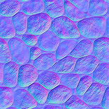
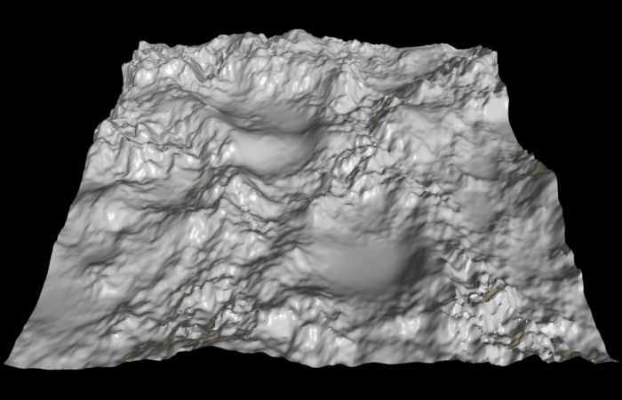

Heightmaps are widely used in terrain rendering. it is an ideal way to store digital terrain elevations; compared to a regular polygonal mesh, they require substantially less memory for a given level of detail. Most modern 3D computer modelling programs are capable of using data from heightmaps in the form of bump, normal, or displacement maps to quickly and precisely create complex terrain and other surfaces.

---

## 1. Heightmap? 

Height mapping is a similar concept to normal mapping, however this technique is more complex and more performance-expensive. Heightmaps are usually used in conjunction with normalmaps, and often they are used to give extra definition to surfaces where the texture maps are responsible for rendering large bumps and protrusions.

While normal mapping modifies the lighting across the surface of the texture, height mapping goes a step further and actually shifts the areas of the visible surface texture around, to achieve a kind of surface-level occlusion effect.

The effect is drawn onto the surface of the model and does not modify the actual geometry, the “silhouette” of the model will never be modified

A heightmap should be a greyscale image, with white areas representing the high areas of your texture and black representing the low areas.

## 2. Linear interpolation

### 2-1. 1D Linear interpolation

### 2-2. Bilinear interpolation

[^1]: <http://en.wikipedia.org/wiki/Syntax_highlighting>

### 2-3.Trilinear interpolation

## 3. Noise sampling

Reserved